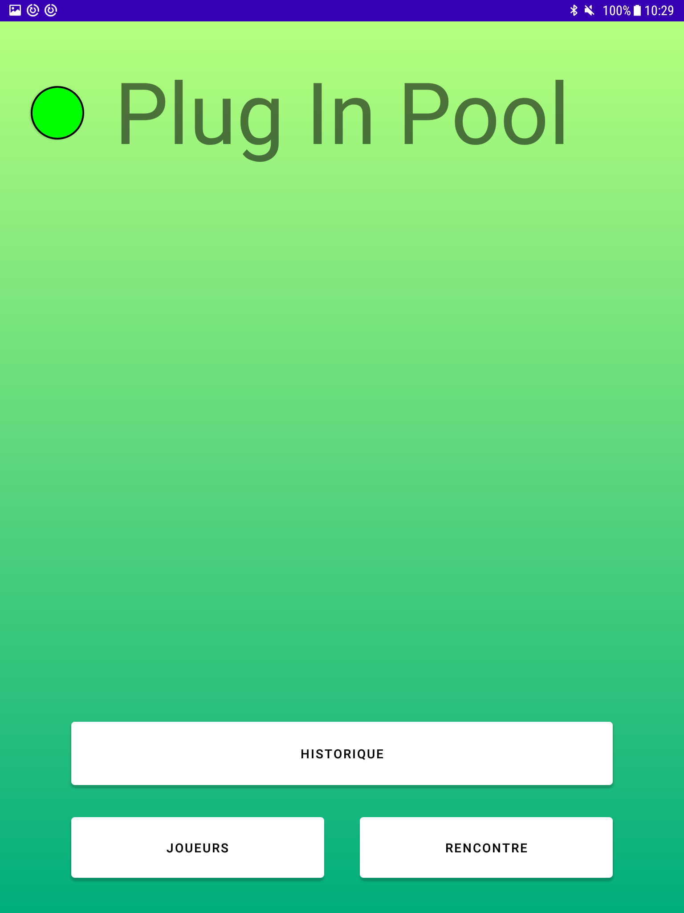
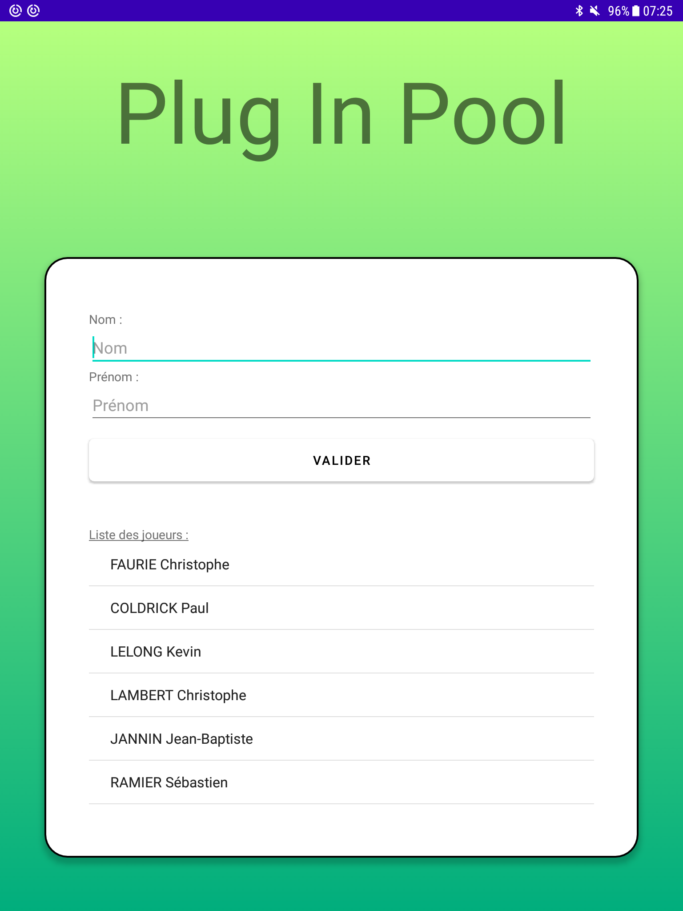
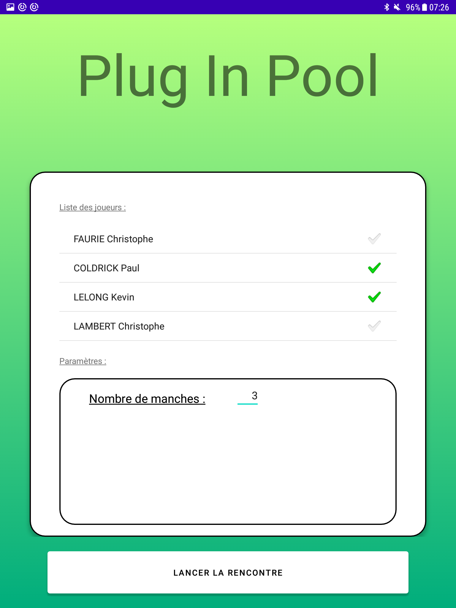
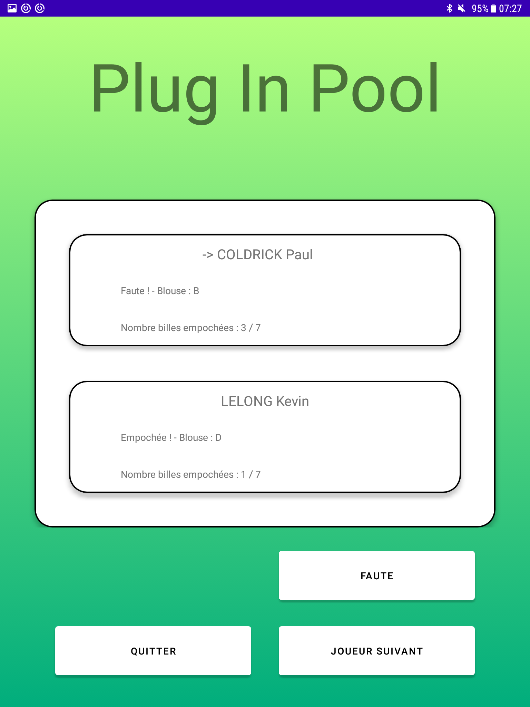
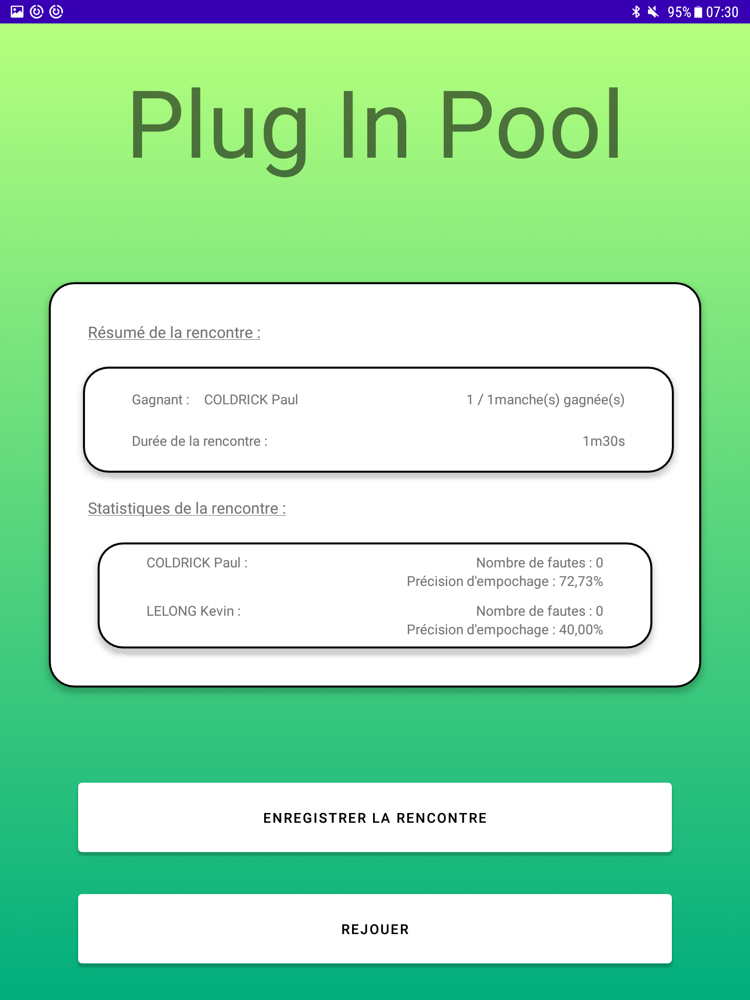

# Le projet plug-in-pool-2022

- [Le projet plug-in-pool-2022](#le-projet-plug-in-pool-2022)
  - [Présentation](#présentation)
  - [Fonctionnalités Mobile-POOL](#fonctionnalités-mobile-pool)
  - [Documentation du code](#documentation-du-code)
  - [Captures Mobile-POOL](#captures-mobile-pool)
  - [TODOs Mobile-POOL](#todos-mobile-pool)
  - [Fonctionnalités Écran-POOL](#fonctionnalités-écran-pool)
  - [Historique des versions](#historique-des-versions)
  - [Auteurs](#auteurs)
  - [Kanban](#kanban)

## Présentation

Système numérique permettant de jouer au billard BlackBall

- Automatisation du déroulement d’une partie
- Affichage du nombre de billes empochées et/ou restantes
- Enregistrement des données d’une partie finie

Le système Plug-in-Pool est décomposé en trois modules :

- Module de gestion de partie (**Mobile-POOL** IR)​ : les joueurs paramètrent et lancent la partie à partir d’une application sur un terminal mobile (sous Android) ;
- Module de détection des billes (Détection-POOL EC)​: le billard est équipé de capteurs permettant de détecter l’empochage et la couleur d’une bille.
- Module de visualisation de partie (**Écran-POOL** IR) ​ : le déroulement de la partie est affiché sur un écran de télévision.

## Fonctionnalités Mobile-POOL

Application mobile qui gère le déroulement des rencontres

- Initialiser une communication
- Connecter une table de billard
- Dialoguer avec une table de billard
- Enregistrer un nouveau joueur
- Sélectionner deux joueurs pour une partie
- Paramétrer le nombre de manches gagnantes pour une partie
- Démarrer une partie
- Gérer la partie et Afficher le score d’une partie
- Afficher le joueur courant
- Afficher les billes empochées/à empocher de chaque joueur
- Terminer une partie
- Afficher les statistiques d'une partie

## Documentation du code

https://btssn-lasalle-84.github.io/plug-in-pool-2022/

## Captures Mobile-POOL

## TODOs Mobile-POOL

- [ ] Enregistrer une partie
- [ ] Afficher l’historique des parties
- [ ] Améliorer l'affichage graphique du déroulement d'une partie et du score

## Fonctionnalités Écran-POOL

Ce module correspond à la partie “affichage” du système. Il a pour objectifs de réaliser la ​récupération d’informations​ envoyées par le terminal mobile et l’affichage de la rencontre actuelle. Il communique en Bluetooth uniquement avec le terminal mobile Android.

Sur l'écran, les joueurs pourront visualiser en continu :

- le nom des joueurs (si existant), la durée écoulée de la partie ;
- les billes empochées et restantes,
- le nombre de manches gagnées par chaque joueur
- des statistiques

L’application Qt s’exécutera en mode “Kiosque” sur le Raspberry Pi.

## Historique des versions

- version 0.2 : 25/05/2022
- Version 0.1 : 02/04/2022

## Auteurs

- Version Mobile Android : Pierre Meras <<pierremeras@hotmail.fr>>
- Version Desktop Qt : Christopher PHILIPPE <<christopher.philippe84@gmail.com>>

## Kanban

[plug-in-pool-2022](https://github.com/btssn-lasalle-84/plug-in-pool-2022/projects/1)
