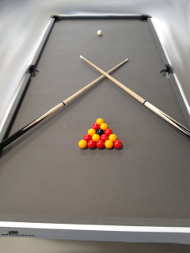
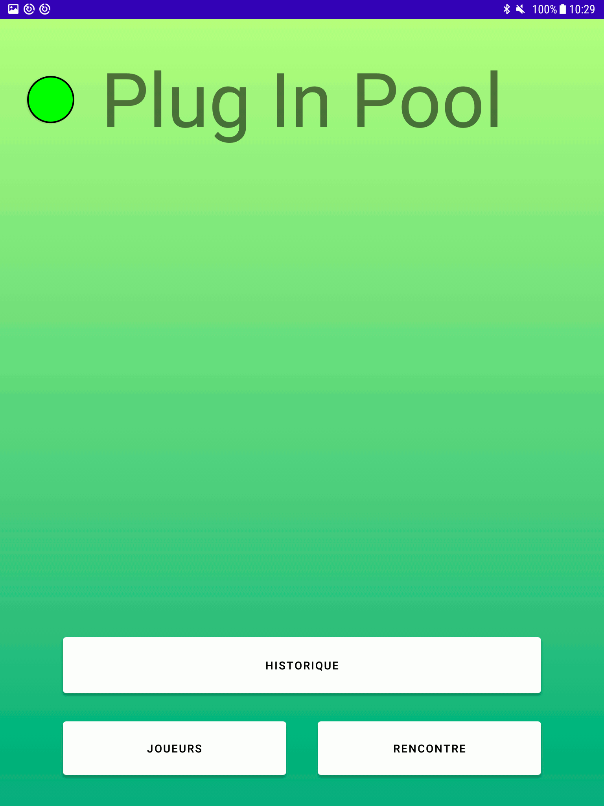
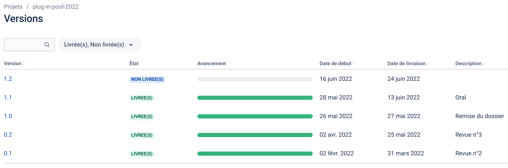

# Le projet plug-in-pool-2022

- [Le projet plug-in-pool-2022](#le-projet-plug-in-pool-2022)
  - [Présentation](#présentation)
  - [Fonctionnalités Mobile-POOL](#fonctionnalités-mobile-pool)
  - [Protocole](#protocole)
  - [Diaporama](#diaporama)
  - [Documentation du code](#documentation-du-code)
  - [Historique des versions](#historique-des-versions)
  - [Auteur](#auteur)
  - [Kanban](#kanban)

## Présentation

Système numérique permettant de jouer au billard BlackBall :

- Automatisation du déroulement d’une partie
- Affichage du nombre de billes empochées et/ou restantes
- Enregistrement des données d’une partie finie

Le système Plug-in-Pool est décomposé en trois modules :

- Module de gestion de partie (**Mobile-POOL** IR)​ : les joueurs paramètrent et lancent la partie à partir d’une application sur un terminal mobile (sous Android) ;
- Module de détection des billes (Détection-POOL EC)​: le billard est équipé de capteurs permettant de détecter l’empochage et la couleur d’une bille.
- Module de visualisation de partie (Écran-POOL IR) ​ : le déroulement de la partie est affiché sur un écran de télévision.

## Fonctionnalités Mobile-POOL

Application mobile qui gère le déroulement des rencontres

- Initialiser une communication
- Connecter une table de billard
- Dialoguer avec une table de billard
- Enregistrer un nouveau joueur
- Sélectionner deux joueurs pour une partie
- Paramétrer le nombre de manches gagnantes pour une partie
- Démarrer une partie
- Gérer la partie
- Afficher le joueur courant
- Afficher les billes empochées/à empocher de chaque joueur
- Terminer une partie
- Enregistrer une partie
- Afficher l’historique des parties
- Afficher les statistiques d'une partie

## Protocole

- [Protocole PlugInPool.pdf](docs/Protocole%20PlugInPool.pdf)

## Diaporama

- [Diaporama Plug In Pool Revue Finale - Pierre MERAS.pptx](docs/Diaporama%20Plug%20In%20Pool%20Revue%20Finale%20-%20Pierre%20MERAS.pptx)

## Documentation du code

https://btssn-lasalle-84.github.io/plug-in-pool-2022/

## Historique des versions

- [version 1.1](https://github.com/btssn-lasalle-84/plug-in-pool-2022/releases/tag/1.1) : 11/06/2022
- [version 1.0](https://github.com/btssn-lasalle-84/plug-in-pool-2022/releases/tag/1.0) : 27/05/2022
- [version 0.2](https://github.com/btssn-lasalle-84/plug-in-pool-2022/releases/tag/0.2) : 25/05/2022
- [version 0.1](https://github.com/btssn-lasalle-84/plug-in-pool-2022/releases/tag/0.1) : 02/04/2022

## Auteur

- Version Mobile Android : Pierre Meras <<pierremeras@hotmail.fr>>

## Kanban

[plug-in-pool-2022](https://github.com/btssn-lasalle-84/plug-in-pool-2022/projects/1)

©️ LaSalle Avignon
